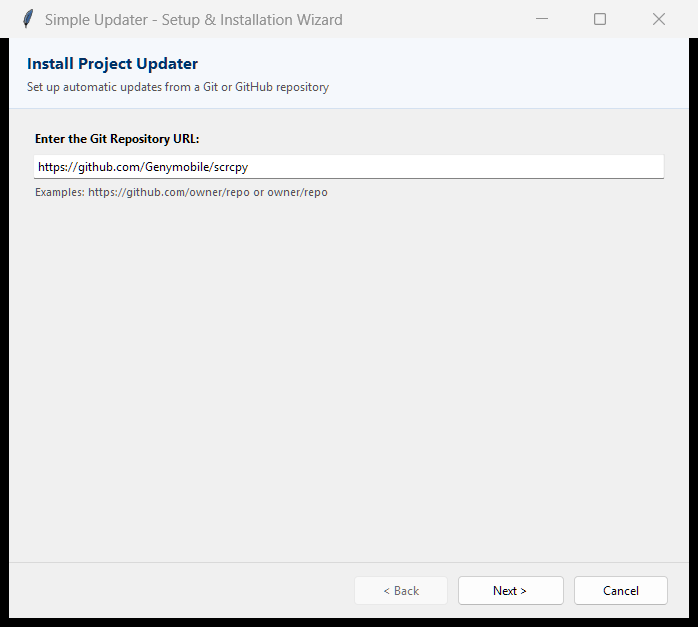
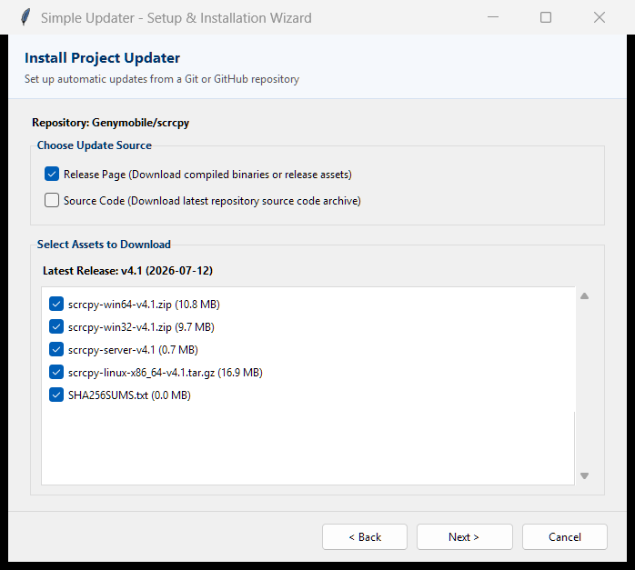
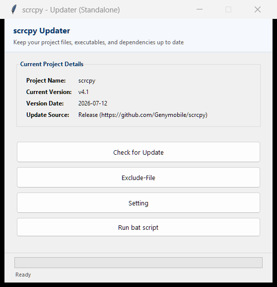
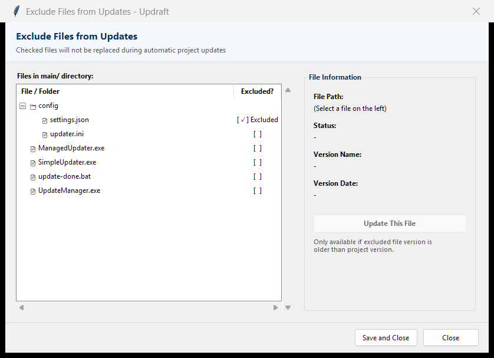
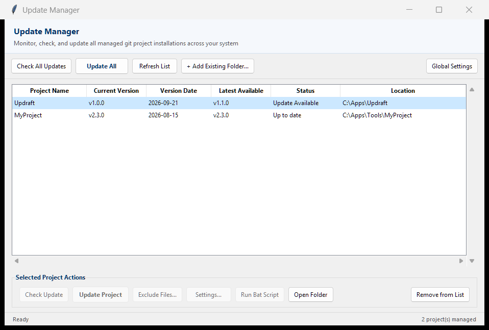

<p align="center">
  
</p>

<h1 align="center">Updraft</h1>
<p align="center"><strong>Git Project Updater Control</strong></p>

<p align="center">
  <a href="LICENSE"></a>
  <a href="https://github.com/SPdream99/updraft/actions/workflows/build.yml"></a>
  <a href="https://github.com/SPdream99/updraft/releases"></a>
  <a href="https://github.com/SPdream99/updraft/releases"></a>
</p>

<p align="center">
  A standalone updater suite for any GitHub project. Drop it in any folder, point it at a repository, and it handles downloading, extracting, and keeping your project up to date — automatically.
</p>

---


## What it does

Updraft ships as three separate executables:

**SimpleUpdater.exe** — The standalone version. It lives inside your project folder and reads its configuration from a local `updater-info.ini` file. No installation required, no external dependencies.

**ManagedUpdater.exe** — The managed version. It works identically to the standalone version but also registers itself with a central registry in `%APPDATA%\Updraft`. This allows the Update Manager to track and manage it.

**UpdateManager.exe** — A central dashboard for all managed instances. From a single window, you can check for updates, update all projects at once, manage file exclusions, and adjust per-project or global settings.

---

## Getting started

### First run — Install phase

When launched in a folder without an existing configuration, the updater opens a setup wizard:

1. Enter a GitHub repository URL (`https://github.com/owner/repo` or shorthand `owner/repo`).
2. Choose an update source:
   - **Release Page** — select one or more release asset files to download.
   - **Source Code** — download the latest commit as a zip archive.
3. Set completion options:
   - Open 'main' folder when done.
   - Delete temporary compressed archives.
   - Run script on completion (`update-done.bat`).
   - Create shortcuts for executables, links, and Python scripts with configurable subfolder depth:
     - Root level only (`main/`)
     - Up to 1 level of subfolders (`main/*`)
     - Up to 2 levels of subfolders (`main/*/*`)
     - Up to 3 levels of subfolders (`main/*/*/*`)
     - All subfolder levels (Unlimited)

<p align="center">
  
  
</p>

The updater then:
- Creates a project folder named after the repository.
- Downloads and extracts files into a `main/` subdirectory with no extra nesting.
- Generates a blank `update-done.bat` for post-update automation.
- Creates Windows shortcuts (`.lnk`) or `.bat` launchers for executables, HTML documents, and Python scripts based on your chosen folder depth.
- Saves configuration to `updater-info.ini`.

---

### Subsequent runs — Update phase

The updater opens directly to the dashboard and displays the current version.

<p align="center">
  
</p>

From here:

- **Check for Update** — queries GitHub for a newer release or commit. Shows a comparison before downloading. Preserves excluded files.
- **Exclude-File** — browse files in `main/` and mark any file to be skipped during updates. Excluded files can also be updated individually.
- **Setting** — toggle post-download options, startup updates, app self-updates, and shortcut creation folder depth.
- **Run bat script** — execute `update-done.bat` in a visible terminal, starting in `main/`.
- **Create Shortcuts** — generate or regenerate Windows shortcuts and launcher scripts in the project folder according to configured folder depth limits.

---

### File exclusion manager

Protect local configurations, save files, or custom scripts from being overwritten during updates.

<p align="center">
  
</p>

- **Real-time search**: Search files instantly by filename or relative path with a single-click clear button.
- **Multi-criteria filters**: Filter by All Files, Excluded Only, Included Only, Updates Available, Executables, Configurations & Data, or Python & Scripts.
- **Interactive sorting**: Click column headers (Name, Folder, Excluded?, Size) to toggle ascending/descending sort, or pick from the Sort dropdown.
- **View modes**: Switch between Hierarchical Folder Tree and Flat List view.
- **Batch operations**: One-click actions to Exclude All Filtered, Include All Filtered, or Invert Filtered Selection.
- **Individual updates**: Update a single protected file from the repository when a newer version is available.

---

### Central Update Manager

Monitor, check, and update all managed Git installations across your PC from one central window.

<p align="center">
  
</p>

- Supports one-click **Check All Updates** and **Update All**.
- Per-project actions: Check, Update, Exclude Files, Settings, Run Script, Create Shortcuts, or Open Folder.

---

## Auto-update on machine launch

Updraft can automatically check and update your managed projects in the background whenever your computer starts:

- **Non-intrusive**: Configured via the standard Windows user registry key (`HKCU\Software\Microsoft\Windows\CurrentVersion\Run`), requiring no administrator privileges.
- **Headless background execution**: Runs silently with `--startup`, downloads and installs matched updates without interrupting your workflow, preserves excluded configuration files, and triggers `update-done.bat` if configured.
- **Logging and notifications**: Records all startup actions to `%APPDATA%\SimpleUpdater\startup_update.log` and displays a Windows desktop notification whenever projects are updated.
- **How to enable**:
  - In `UpdateManager.exe`, click **Global Settings**, check **Check and update all managed projects on Windows startup**, and click **Save and Close**.
  - Individual projects can opt out of startup updates via their respective **Settings** dialog.
- **Updraft self-update on startup**: The background startup runner also checks for Updraft releases. When a new version is detected, it automatically updates all registered `ManagedUpdater.exe` instances and stages `UpdateManager.exe` cleanly without disruptive window popups.

---

## Application self-updating

Updraft executables (`SimpleUpdater.exe`, `ManagedUpdater.exe`, and `UpdateManager.exe`) can update themselves directly:

- **Dedicated update button**: Click **Update Updraft (v1.0.0)** in the main updater or manager dashboard toolbar to immediately check for newer releases.
- **Update all instances via Update Manager**: When updating Updraft through Update Manager, it updates `UpdateManager.exe` and automatically distributes the new `ManagedUpdater.exe` binary across all registered project directories on your machine.
- **Automatic update on launch**: When enabled (default: on), the application checks GitHub in the background upon launch and alerts you if a newer version is available with one-click installation.
- **Seamless binary replacement**: Since Windows locks running executables, Updraft stages the downloaded binary, coordinates a clean handoff through a detached helper, swaps the executable, and automatically restarts the new version.
- **Configurable**: Toggle application self-updates on or off in the **Settings** dialog.

---

## Smart asset matching

When a new release is published, asset file names often change (e.g., `app-win64-v1.0.zip` becomes `app-win64-v1.1.zip`). Updraft resolves this automatically using a three-tier matching algorithm:

1. **Exact match** — filename is identical.
2. **Tag substitution** — replaces the old version tag with the new one.
3. **Version pattern masking** — strips version segments using regex and matches by structure (prefix, suffix, extension).

If no match can be found — for example, when a maintainer completely renames a file — a dialog appears listing the new release assets so you can pick a replacement. Your selection is saved and used for future updates.

---

## Project structure

```
updraft/
├── core/
│   ├── asset_matcher.py    # Smart release asset matching algorithm
│   ├── config.py           # updater-info.ini and AppData registry
│   ├── downloader.py       # Download, extraction, exclusion, and shortcut logic
│   ├── git_client.py       # GitHub API client (releases, commits, assets)
│   ├── self_updater.py     # In-place self-update and binary swap orchestration
│   ├── startup.py          # Windows startup registry & silent background runner
│   ├── theme.py            # Windows 7 Aero GUI styling & window icons
│   └── version.py          # Application metadata and version definitions
├── gui/
│   ├── asset_picker_dialog.py  # Fallback asset picker when filenames change
│   ├── exclude_window.py       # File exclusion tree view
│   ├── install_wizard.py       # First-run setup wizard
│   ├── manager_window.py       # Update Manager central dashboard
│   ├── settings_window.py      # Settings dialog
│   └── updater_window.py       # Main updater dashboard
├── tests/
│   └── test_all.py         # Unit and integration tests
├── build.py                # PyInstaller build script
├── standalone_updater.py   # Entry point: SimpleUpdater.exe
├── managed_updater.py      # Entry point: ManagedUpdater.exe
└── update_manager.py       # Entry point: UpdateManager.exe
```

---

## Building from source

Requires Python 3.13+ and PyInstaller.

Install dependencies:
```
pip install requests pyinstaller pywin32
```

Build all three executables:
```
python build.py
```

Output goes to `dist/`:
- `dist/SimpleUpdater.exe`
- `dist/ManagedUpdater.exe`
- `dist/UpdateManager.exe`

Run tests:
```
python -m unittest discover -s tests
```

---

## Requirements

- Windows 7 or later (tested on Windows 10 and 11)
- GitHub repository (public or with token for private)
- Internet access for update checks

---

## Notes

- Antigravity contributed to the development of this app.
- The `update-done.bat` file is created blank on first install. Edit it to run any post-update commands (rebuild steps, restart scripts, etc.).
- The `main/` folder and `updater-info.ini` are excluded from version control by default. Do not delete `updater-info.ini` unless you want to re-run the setup wizard.
- Shortcuts: Automatically discovers executables (`.exe`, `.bat`, `.cmd`, `.ps1`, `.vbs`, etc.), Python scripts (`.py`, `.pyw`), web/document links (`.html`, `.htm`, `.url`), and subfolders (e.g. saves, docs, tools) up to the configured folder depth (default: up to 1 level of subfolders). Subfolder shortcuts open directly in Windows Explorer. Python scripts are wrapped in launcher `.bat` files that auto-detect python/py and pause on errors. Each project can personalize shortcut rules, prefixes, and target folder layout (project root or dedicated `Shortcuts/` folder) via the Shortcut Customizer dialog.

---

## License

MIT
